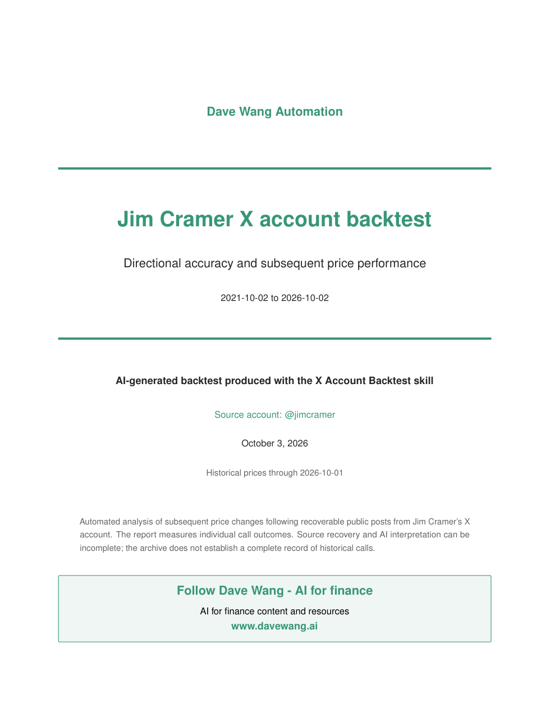

# X Account Backtest — Dave Wang Automation

Give Codex an X account and a period. The skill reviews recoverable authored posts, identifies explicit and inferred bullish/bearish investment views, measures subsequent prices, and produces a source-linked PDF with statistical charts.

```text
$x-account-backtest @jimcramer last 5 years
```

The user supplies the question. The assistant handles source interpretation and report writing; Python performs the calculations. **No separate AI provider or AI API key is required.** Historical posts and market prices still need an available data connector, existing provider access or a supplied export.

## Install in Codex

Open Codex and paste:

```text
$skill-installer Install the skill from https://github.com/davidwang95/x-account-backtest/tree/main/skills/x-account-backtest and prepare its Python requirements.
```

After installation, send the backtest command in your next message. If it is not discovered, start a new Codex task. No separate AI API key is needed. A real backtest requires historical X posts and market prices through existing provider access, a connector or a supplied export; provider charges may apply.

**[Download the one-page installation guide](docs/x-account-backtest-quickstart.pdf)** for the install prompt, example command and output overview.

The public repository is [davidwang95/x-account-backtest](https://github.com/davidwang95/x-account-backtest). You can also download its ZIP, extract it, and ask Codex to install the local skill from that folder.

Codex can run `python tools/install_local.py` to perform the local copy. The installer preserves an existing installation rather than overwriting it. `python tools/package.py --output /path/outside/repository/x-account-backtest.zip` creates a clean shareable package with file hashes.

Python 3.11+ is required. Use the host's bundled libraries when available, or install the skill's `requirements.txt` into an isolated environment. The report builder writes editable LaTeX; PDF backends and their selection are documented in the report reference. Never add data-provider secrets to the repository.

## Example report

The packaged [Jim Cramer example PDF](examples/jimcramer-backtest-example.pdf) uses the existing frozen study of recoverable posts from October 2, 2021 through October 2, 2026, with prices through October 1, 2026. It is AI-generated output and does not establish a complete historical call census. The example contains aggregate results and limited linked source excerpts; the underlying post archive, credentials and price caches are not included.



## What it produces

- Dave Wang Automation PDF, clearly labeled AI-generated skill output.
- Visible **Follow Dave Wang — AI for finance** CTAs linked to [www.davewang.ai](https://www.davewang.ai).
- Directional and SPY-relative hit rates, signed returns, bullish/bearish and action/thesis breakdowns, uncertainty and robustness checks.
- Publication coverage, exclusions, pending horizons and missing prices.
- Source-linked call ledger, editable LaTeX, vector/high-resolution charts and plotted-data CSVs.
- Frozen configuration, input/output hashes and independent return reconciliation.

The standard engine scores verified US stocks/ETFs and separately identifiable crypto USD spot views. Macro, FX, rates, commodities, international securities and unresolved themes remain visible but unscored unless a validated extension is designed. It measures subsequent performance of calls; it does not fabricate a tradeable portfolio or compounded NAV.

## Architecture

```text
skills/x-account-backtest/
  SKILL.md                 simple invocation and stage router
  agents/openai.yaml       Codex discovery metadata
  instructions/            retrieval → interpretation → scoring → report → QA
  references/              method, input/output contracts, providers, design
  scripts/                 checkpointed adapters, deterministic calculations, charts/PDF
  good-vs-bad/              calibrated interpretation/writing examples
  evals/                   synthetic offline cases and end-to-end runner
  requirements.txt
```

This follows the progressive instruction/contract/script/evaluation structure of [Dave Wang's earnings-call skill](https://github.com/davidwang95/analyze-earnings-calls). It keeps measurement separate from language interpretation. Reports are generated by a skill and carry no personal-research byline or research-firm branding.

## Validate

From the repository root:

```text
python -m unittest discover -s skills/x-account-backtest/scripts -p "test_*.py"
python skills/x-account-backtest/evals/run_evals.py
```

Offline fixtures are synthetic. They make no network calls and contain no user archive, provider credentials or historical-price cache. Source citations, future-data timing, exact required bars, neutral denominators, attribution and frozen-file tampering are tested.

## Use a supplied archive

After freezing a study, normalize an export into the documented `posts.json` contract and import it with the verified numeric author ID. Preserve whether the export is complete or sampled. Price imports use exact dated split-adjusted bars and an independently checked session calendar. The assistant must never describe selected web-search anecdotes as an exhaustive account backtest.

See [the installed skill](skills/x-account-backtest/SKILL.md) for the complete workflow and [provider contracts](skills/x-account-backtest/references/providers.md) for source/access details.

For more AI-for-finance content and resources, follow Dave Wang at [www.davewang.ai](https://www.davewang.ai).
